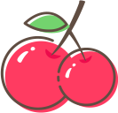
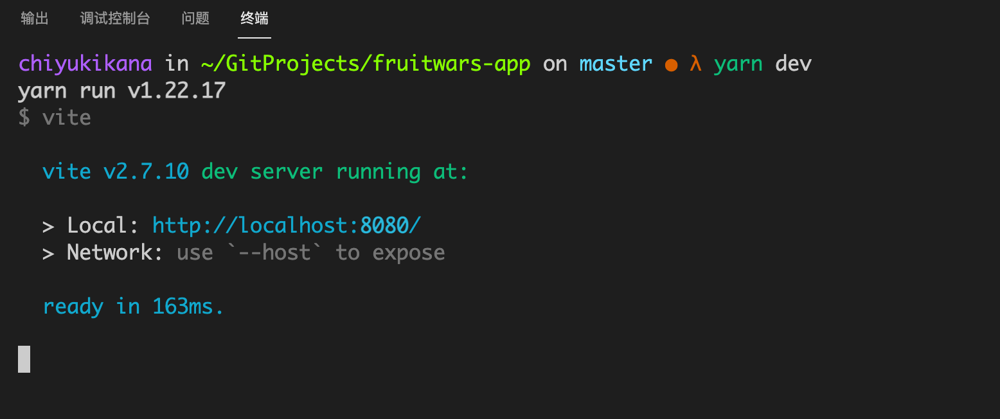

    

 

# 水果大作战

注：本项目仅供学习使用！

在线游玩地址：[Github Pages](https://chiyukikana.github.io)

## 技术栈

| 名称       | 链接                            | 版本    |
| :--------- | ------------------------------- | ------- |
| TypeScript | <https://www.typescriptlang.org/> | 4.5.4   |
| Webpack5   | <https://webpack.docschina.org/>  | 5.65.0  |
| Vite.js    | <https://vitejs.dev/>             | 2.7.10  |
| Node.js    | <https://nodejs.org/en/>          | 14.17.6 |
| jQuery     | <https://jquery.com/>             | 3.6.0   |

## 脚本命令

本项目使用 yarn 作为包管理器，如果您还未安装 yarn 请先使用 NPM 进行安装。

`npm -g install yarn@latest` 全局安装 yarn

- `yarn dev` - 启用本地开发环境服务
- `yarn build` - 以生产环境构建
- `yarn serve` - 启用本地生产环境服务
- `yarn format` - 使用 Prettier 工具格式化代码

## 开启本地服务器

1. 输入命令 `yarn` 安装本地依赖。
2. 输入脚本 `yarn dev` 开启本地服务器。

最后如下图所示，即在本地的 8080 端口中开启服务器。

## 游戏说明

在该游戏中，玩家将需要使用鼠标拖动🧺进行移动，目标是在有限的时间内拾取更多的水果，拿取更多的分数。当游戏的难度到达一定高度时，你的目标可能不再是拾取更多水果，而是躲避所有的水果。

玩家初始拥有90秒的游戏时间，在游戏中可以拾取道具来增加游戏时间。倒计时结束，游戏结束。

玩家初始拥有5点生命值，最大上限为10点。

#### 生命值增加有以下条件

1. 每次累计拾取10次新鲜水果可以增加1点生命值，过程中如果拾取到腐烂水果将重新累计

#### 生命值减少有以下条件

1. 当玩家的分数在负数以下，每次拾取腐烂水果将减少生命值。
2. 每次累计拾取5次腐烂水果，将减少1点生命值。

#### 游戏分数增加有以下条件

1. 拾取新鲜水果可以增加游戏分数
2. 每次累计拾取15个新鲜水果必定奖励15个水果总和的35%分数。如果途中拾取到腐烂水果，将重新累计。当获得奖励分数的时候会播放特殊的音效。

#### 游戏分数减少有以下条件

1. 拾取腐烂水果将减少游戏分数。

玩家在5秒内不进行移动，则会减少1点生命值，若玩家的游戏分数大于0，则会额外失去当前分数的10%。
腐烂水果在游戏中一般以灰色的样子出现。
游戏每进行一段时间将会增加难度，初始难度1级。
